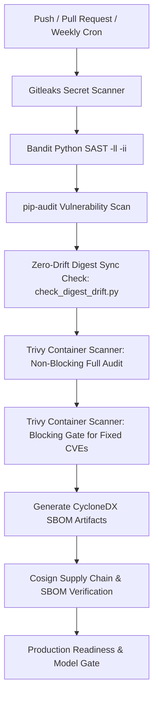

<div align="center">

# 🛡️ AEGIS Phishing Intelligence Platform
### Enterprise-Grade, Zero-Trust DevSecOps & Container Infrastructure

[](#-devsecops--ci-cd-pipeline)
[](#-7-layer-defense-in-depth-architecture)
[](#)
[](#-pipeline-scan-duration--timing-breakdown)
[](#-shared-data-bus--shared_scans-volume)
[](#-devsecops--ci-cd-pipeline)

*A self-contained, multi-network container ecosystem engineered for high-speed, zero-leakage phishing detonation, multi-modal DOM/vision risk fusion, and automated IOC extraction.*

</div>

---

## 🌟 Executive Summary & Overview

The **AEGIS Phishing Intelligence Platform** is an advanced orchestration suite and security pipeline designed to ingest, detonate, and classify suspicious web URLs, credential harvesting pages, and drive-by downloads in real time. 

Traditional sandbox architectures suffer from structural vulnerabilities: workers processing untrusted web content frequently have direct access to the `docker.sock` (allowing trivial container escape to host root), or headless browsers leak internal infrastructure addresses via WebRTC, mDNS, and DNS rebinding (`TOCTOU` attacks). 

AEGIS eliminates these attack vectors by enforcing a **7-Layer Defense-in-Depth Architecture**. Every component operates within strict least-privilege boundaries across three physically isolated Docker bridge networks (`aegis_net`, `docker_proxy_net`, and `aegis_sandbox_net`), backed by kernel-level host firewall rules, local proxy inspection, and strict secret segregation.

---

## 🏗️ Stack at a Glance

| Service | Container Name | Base Image | Role & Security Profile | Internal / Host Port |
| :--- | :--- | :--- | :--- | :--- |
| **Receptionist** | `aegis_nginx` | `nginx:1.27-alpine` | Reverse proxy, WebSocket router, & TLS termination. Ephemeral 4096-bit TLS generation (`cap_drop: ALL`, non-root). Supports `REQUIRE_REAL_CERT=true` in staging/production. | `80`, `443` (Host) |
| **API & Auth** | `aegis_backend` | `desktop-backend` | FastAPI / Uvicorn API server. JWT auth with SHA-256 pre-hashing & bcrypt (`UID 1001`). Enforces strict CORS and payload limits. | Internal (`8000`) |
| **Database** | `aegis_postgres` | `postgres:16-alpine` | Primary relational datastore for Users, Scans, IOCs, and Incidents (`UID 999`). Isolated on `aegis_net`. | Internal (`5432`) |
| **Broker & Cache** | `aegis_redis` | `redis:7.2-alpine` | Celery message broker & URL scan cache with AOF persistence (`--appendonly yes`). Protected by `REDIS_PASSWORD`. | Internal (`6379`) |
| **Worker Engine** | `aegis_celery_worker`| `desktop-celery_worker`| Executes Stages 1–4 of the scan pipeline (`pytesseract`, OpenCV, ML Risk Ensemble). **Zero Docker CLI/socket access.** | Internal |
| **Scheduler** | `aegis_celery_beat` | `desktop-celery_beat` | Periodic task scheduler (hourly retention cleanup, 10-minute job reconciliation). | Internal |
| **Admission Control**| `aegis_sandbox_runner`| `desktop-aegis_sandbox_runner`| **RPC Gateway to Docker Socket.** Enforces `X-Runner-Auth` bearer token, UUIDv4 validation, & concurrency limits (`8002`). | Internal (`8002`) |
| **Malware Engine** | `aegis_clamav` | `clamav/clamav:stable` | Isolated `INSTREAM` virus scanning sidecar for quarantined browser artifacts & downloads. | Internal (`3310`) |
| **Detonation Node** | `aegis_sandbox` | `desktop-sandbox` | Ephemeral, read-only Playwright/Chromium container spawned per scan job over isolated network. | Ephemeral |

---

## 🔒 7-Layer Defense-in-Depth Architecture

```
                      [ Browser Extension / Client ]
                                    │
                                    ▼  HTTPS (:443) / WSS (:443)
┌──────────────────────────────────────────────────────────────────────────────────────┐
│  RECEPTIONIST LAYER: aegis_nginx (Non-root, cap_drop: ALL, Ephemeral/Real TLS)       │
└───────────────────────────────────┬──────────────────────────────────────────────────┘
                                    │ /api/* & /ws/* (Proxy Pass)
                                    ▼
┌──────────────────────────────────────────────────────────────────────────────────────┐
│  CORE APPLICATION NETWORK: aegis_net (Isolated from Sandbox & Proxy Socket)          │
│                                                                                      │
│  ┌──────────────────────┐      SQLAlchemy      ┌──────────────────────────────────┐  │
│  │    aegis_backend     │ ───────────────────► │          aegis_postgres          │  │
│  │ (FastAPI / Uvicorn)  │                      └──────────────────────────────────┘  │
│  └──────────┬───────────┘                                                            │
│             │ Enqueue Task                                                           │
│             ▼                                                                        │
│  ┌──────────────────────┐      Dequeue Task    ┌──────────────────────────────────┐  │
│  │     aegis_redis      │ ◄─────────────────── │       aegis_celery_worker        │  │
│  │  (Celery Broker/AOF) │                      │    (Stages 1-4: OCR / Vision)    │  │
│  └──────────────────────┘                      └─────────────────┬────────────────┘  │
└──────────────────────────────────────────────────────────────────┼───────────────────┘
                                                                   │ Authenticated RPC
                                                                   │ (X-Runner-Auth + UUIDv4)
                                                                   ▼
┌──────────────────────────────────────────────────────────────────────────────────────┐
│  ADMISSION CONTROL LAYER: aegis_sandbox_runner (FastAPI on docker_proxy_net)         │
│  • Enforces concurrency semaphore (MAX_CONCURRENT_DETONATIONS = 10 -> HTTP 429)      │
│  • Constructs exact, hardcoded, immutable `docker run --cap-drop ALL --read-only`    │
└───────────────────────────────────┬──────────────────────────────────────────────────┘
                                    │ Filtered Socket API
                                    ▼
┌──────────────────────────────────────────────────────────────────────────────────────┐
│  PROXY SOCKET LAYER: docker_socket_proxy (tecnativa/docker-socket-proxy)            │
│  • Severed from Celery workers. Only accessible by aegis_sandbox_runner.            │
└───────────────────────────────────┬──────────────────────────────────────────────────┘
                                    │ Spawn Ephemeral Container
                                    ▼
┌──────────────────────────────────────────────────────────────────────────────────────┐
│  DETONATION NETWORK: aegis_sandbox_net (Zero access to aegis_net or host services)   │
│                                                                                      │
│  ┌────────────────────────────────────────────────────────────────────────────────┐  │
│  │ aegis_sandbox (Chromium Playwright)                                            │  │
│  │ • Read-only rootfs + tmpfs mounts | pids-limit: 512 | memory: 2g | cpus: 1.5   │  │
│  │ • WebRTC/QUIC disabled (--force-webrtc-ip-handling-policy=disable_non_proxied) │  │
│  │ • Chained through local egress_proxy.py (asyncio.Semaphore(50) tunnel limit)   │  │
│  └───────────────────────────────────────┬────────────────────────────────────────┘  │
│                                          │ INSTREAM Malware Check                    │
│                                          ▼                                           │
│  ┌────────────────────────────────────────────────────────────────────────────────┐  │
│  │ aegis_clamav:3310 (ClamAV Quarantine & Artifact Scanner)                       │  │
│  └────────────────────────────────────────────────────────────────────────────────┘  │
└──────────────────────────────────────────────────────────────────────────────────────┘
                                    │
                                    ▼
┌──────────────────────────────────────────────────────────────────────────────────────┐
│  HOST KERNEL LAYER: Linux iptables DOCKER-USER Chain (scripts/setup_host_firewall.sh)│
│  • Drops all outbound packets from aegis_sandbox_net to:                              │
│    - Cloud Metadata: 169.254.169.254/32 & 169.254.0.0/16                             │
│    - Host Gateways & Loopback: 127.0.0.0/8 & 0.0.0.0/8                               │
│    - RFC 1918 & RFC 6598 (CGNAT): 10.0.0.0/8, 172.16.0.0/12, 192.168.0.0/16          │
└──────────────────────────────────────────────────────────────────────────────────────┘
```

### 🔑 Security Highlights & Deep architectural controls

1. **Strict Secret Segregation Across Trust Boundaries**
   * **No Shared Tokens (`SANDBOX_RUNNER_SECRET` vs `AEGIS_DB_PASSWORD`)**: Each trust boundary within AEGIS maintains its own independent cryptographic credential. The PostgreSQL database credentials (`AEGIS_DB_PASSWORD`) are completely separated from the RPC bearer token (`SANDBOX_RUNNER_SECRET`) required to communicate with `aegis_sandbox_runner`. This ensures that even if a database connection string were compromised, the attacker cannot invoke the Docker socket proxy to run containers.
   * **Production Environment Enforcement**: When `ENVIRONMENT="production"`, `config.py` enforces strict startup validation: all secrets must be at least 32 characters (`len >= 32`), not equal to default development strings, and all CORS/Host settings (`ALLOWED_HOSTS`, `CORS_ALLOWED_ORIGINS`) must be explicitly defined without wildcards (`*`).

2. **Complete Socket Severance & Admission Control (`aegis_sandbox_runner`)**
   * **Zero Docker API Exposure for Workers**: Celery workers processing untrusted web content via OCR (`pytesseract`) and computer vision (`OpenCV`) run inside `aegis_net` with **zero Docker CLI binaries and zero access to the Docker socket**.
   * **Authenticated RPC Gateway**: When a worker needs to detonate a URL, it sends an HTTP POST request to `aegis_sandbox_runner:8002/detonate` over `aegis_sandbox_net`. The runner validates the `X-Runner-Auth` bearer token (`SANDBOX_RUNNER_SECRET`) and ensures the requested `scan_id` matches a strict UUIDv4 regex (`_UUID_RE`).
   * **Immutable Container Command & Concurrency Limits**: The runner constructs a hardcoded, immutable Docker run invocation (`--cap-drop ALL`, `--read-only`, `--tmpfs`, `--security-opt no-new-privileges:true`). It enforces a strict concurrency ceiling (`MAX_CONCURRENT_DETONATIONS = 10`) via an `asyncio.Semaphore`, returning `HTTP 429 Too Many Requests` when saturated instead of overloading the Docker daemon.

3. **Kernel-Level & Application-Layer SSRF Protection**
   * **Host Kernel `DOCKER-USER` Firewall**: `scripts/setup_host_firewall.sh` inserts rules directly into the Linux host `DOCKER-USER` chain. Even if an attacker achieves Remote Code Execution inside the Chromium container and crafts raw packets bypassing the local proxy, the host kernel drops any traffic originating from `aegis_sandbox_net` destined for **Cloud Metadata (`169.254.169.254`)**, loopback (`127.0.0.0/8`), or private IP ranges (`RFC 1918` / `RFC 6598 CGNAT`).
   * **`egress_proxy.py` & `ssrf_guard.py`**: Inside the detonation container, Chromium routes all traffic through a local `asyncio` egress proxy (`127.0.0.1:8888`). The proxy resolves destination hostnames using `ssrf_guard.is_safe_url()`, checking resolved IP addresses against an extensive table of blocked networks (`0.0.0.0/8`, `10.0.0.0/8`, `100.64.0.0/10`, `127.0.0.0/8`, `169.254.0.0/16`, `172.16.0.0/12`, `192.168.0.0/16`). It prevents `TOCTOU` DNS rebinding by connecting directly to the verified `(safe_ip, port)` tuple and limits open tunnels with `asyncio.Semaphore(50)`.

4. **ClamAV Anti-Malware Sidecar (`INSTREAM` Socket)**
   * Every file downloaded by the browser during detonation (`suggested_filename` sanitized against path traversal) or raw DOM structure captured is written to `shared_scans/quarantine/`.
   * The `aegis_clamav` container (`TCP 3310`) inspects artifacts using ClamAV's streaming `INSTREAM` protocol. If `CLAMAV_FAIL_CLOSED=True` is set in production and the scanner daemon is unreachable, the platform fails closed to ensure no unverified artifact is marked clean.

5. **Authentication Hardening, Account Lockout & HIBP Breached Password Check**
   * **SHA-256 Pre-hashing & Timing-Attack Protection**: To safely handle long passwords and prevent `bcrypt` truncation vulnerabilities (`>72 bytes`), all user passwords are pre-hashed with SHA-256 before `bcrypt` rounds. Login flows use constant-time dummy comparisons (`_DUMMY_HASH`) on unknown users to prevent account enumeration.
   * **k-Anonymity Breached Password Validation**: During user registration (`POST /api/auth/register`), the backend queries Have I Been Pwned (`api.pwnedpasswords.com/range/{prefix}`) using only the first 5 hex characters of the SHA-1 hash. Known breached passwords (`score >= 100`) are rejected immediately without leaking user credentials or exposing API connectivity errors (`record_hibp_failure_metric` alerting).
   * **Redis-Backed Account Lockout & JWT Revocation**: Repeated failed logins trigger an automatic temporary lockout per IP and email. On explicit logout or password reset, the JWT `jti` is added to a Redis blacklist with a TTL matching exactly the token's remaining validity window.

6. **Automated File & Job Cleanup (`file_cleanup.py` & `job_reconciliation.py`)**
   * **Disk Exhaustion Prevention**: Celery beat triggers `file_cleanup_task` every hour, scanning `shared_scans/` and removing per-scan `UUID` directories and quarantined samples older than `ARTIFACT_RETENTION_DAYS` (default 14 days), as well as any orphan files left behind by crashed runs.
   * **Job Reconciliation**: Every 10 minutes, `reconcile_stale_jobs_task` inspects PostgreSQL for any scan tasks stuck in `pending` or `running` states longer than their timeout thresholds, cleanly transitioning orphaned jobs to `failed_timeout`.

---

## ⚡ Pipeline Scan Duration & Timing Breakdown

An end-to-end URL detonation through the 5-stage Celery pipeline completes in **10 to 20 seconds** on standard web targets. Below is the exact execution flow across each stage:

| Pipeline Stage | Module & Tasks Performed | Typical Duration | Timeout / Safety Ceiling |
| :--- | :--- | :--- | :--- |
| **Stage 1: Feature Extraction** | `browser_features.py`<br>Fetches initial page HTML, extracts DOM feature metrics (`dom_extractor.py`), runs `pytesseract` OCR recognition on initial visual captures, and computes perceptual image hashes. | **2 – 5 sec** | ~10 sec |
| **Stage 2: Sandbox & Malware** | `sandbox_analysis.py`<br>**Container Detonation:** Issues RPC `POST /detonate` to `aegis_sandbox_runner:8002`, spawning an ephemeral read-only `aegis-sandbox` container over `aegis_sandbox_net` to navigate the target URL, wait for DOM stability, capture network HAR files, and collect screenshots.<br>**Malware Inspection:** Streams downloaded binaries and DOM dumps to `aegis_clamav:3310` via `INSTREAM`. | **6 – 15 sec** | **45 sec** (Chromium navigation timeout)<br>or **120 sec** (`SANDBOX_TIMEOUT_SEC` hard ceiling) |
| **Stage 3: Cloaking Detection** | `consistency.py`<br>Runs `ConsistencyEngine` (`consistency_engine.py`) to perform structural and visual diffing (`phash` / pixel difference) between Stage 1 initial browser features and Stage 2 deep sandbox telemetry, identifying **cloaking** (sites serving benign pages to bots but phishing kits to real users). | **0.2 – 0.8 sec** | ~2 sec |
| **Stage 4: ML Risk Ensemble** | `risk_fusion.py`<br>Aggregates multi-modal signals across OCR, DOM structure, URL heuristics, and cloaking similarity into a unified risk verdict (`0–100`). Updates PostgreSQL, caches real verdicts in Redis (`300s` Stage 1 -> `3600s` authoritative), and emits real-time `"Done"` event via WebSocket.<br>*(Note: Model weights are currently placeholder (`is_placeholder=True`) while the ML ensemble is trained externally).* | **0.3 – 0.7 sec** | ~2 sec |
| **Stage 5: Incident Alerting** | `alert_pipeline.py`<br>*(Triggered asynchronously when risk level is `HIGH` or `CRITICAL`)*. Generates formal `Incident` and `IOC` records in PostgreSQL and dispatches SIEM/Slack notifications without delaying user UI responses. | **Async (~1 sec)** | Non-blocking |

### 🕒 Execution Scenarios
* **Fast Path (~10 to 18 seconds):** Standard responsive landing pages load and settle quickly; the final classification is emitted over WebSocket almost immediately.
* **Bot-Challenged Path (~25 to 35 seconds):** When encountering Cloudflare or anti-bot interstitials, Playwright automatically waits up to **10 seconds** (`challenge_wait_seconds`) for the challenge to clear before capturing final DOM and screenshot evidence.
* **Tarpit Protection (120 seconds):** If a malicious server holds open connections indefinitely (`HTTP Tarpit`), `aegis_sandbox_runner` forcefully terminates the container after exactly `SANDBOX_TIMEOUT_SEC` (120s).

---

## 💾 Shared Data Bus — `shared_scans` Volume

All stages communicate cleanly without passing multi-megabyte image payloads through Redis memory by mounting the `aegis_shared_scans` Docker volume across `aegis_backend`, `celery_worker`, `aegis_sandbox_runner`, and the ephemeral `aegis_sandbox` containers:

```
shared_scans/
├── quarantine/                  ← ClamAV quarantined downloads and dropped binary artifacts
└── <scan_id>/                   ← Canonical UUIDv4 directory per detonation job
    ├── browser.png              ← Stage 1: Initial browser viewport screenshot
    ├── browser.html             ← Stage 1: Initial raw page HTML
    ├── browser_features.json    ← Stage 1: OCR text, vision hashes, and DOM feature metrics
    ├── sandbox.png              ← Stage 2: Sandbox full-page screenshot after challenges
    ├── sandbox.html             ← Stage 2: Sandbox rendered DOM HTML
    ├── sandbox_metadata.json    ← Stage 2: Network HAR requests, redirect chains, & TLS details
    ├── consistency_report.json  ← Stage 3: Cloaking and behavioral diff evaluation metrics
    ├── cyberintel.json          ← Stage 4: External threat intelligence feed aggregations
    └── risk_report.json         ← Stage 4: Final ensemble score & classification verdict
```

---

## 🛠️ DevSecOps & CI/CD Pipeline

AEGIS incorporates automated continuous security enforcement via GitHub Actions (`.github/workflows/devsecops.yml`) and local developer verification suites:



> **Supply Chain Attestation (`Cosign`):** Our CI pipeline (`devsecops.yml`) runs full end-to-end local validation of Cosign container signing, CycloneDX SBOM generation across all services (`backend`, `worker`, `runner`, `sandbox`, `nginx`), and signature verification using ephemeral CI keypairs (`cosign generate-key-pair` + `cosign verify`). This exercises and proves the cryptographic signing mechanics on every PR without polluting remote repositories, before promoting to keyless OIDC transparency log signing (`sigstore`) during production release workflows.

### 🧰 Local Security & Automation Commands

We provide a comprehensive `Makefile` (Linux / macOS / WSL) and `aegis.ps1` helper script (Windows PowerShell) for rapid onboarding and verification:

```powershell
# ==============================================================================
# 1. Makefile Security & Supply Chain Commands (Linux / macOS / WSL)
# ==============================================================================
make pin-sandbox                      # Build & pin immutable SANDBOX_IMAGE sha256 digest into .env
make security-scan                    # Run local SAST, dependency audits, & Trivy image scans
make run-scan                         # Execute E2E integration verification scan (run_scan.py)

# ==============================================================================
# 2. Host Kernel Firewall Setup (Linux Deployment Hosts)
# ==============================================================================
sudo bash scripts/setup_host_firewall.sh 172.28.0.0/16  # Enforce DOCKER-USER chain isolation

# ==============================================================================
# 3. PowerShell Management Helper (Windows / PowerShell)
# ==============================================================================
.\aegis.ps1 up                        # Start all core services in background
.\aegis.ps1 status                    # Display container health, ports, and memory usage
.\aegis.ps1 logs                      # Follow aggregated colorized logs across all containers
.\aegis.ps1 sandbox https://site.com  # Trigger an immediate test detonation via API
.\aegis.ps1 build                     # Rebuild all local Docker images cleanly
.\aegis.ps1 shell                     # Open interactive bash shell inside aegis_backend
.\aegis.ps1 reset                     # DESTRUCTIVE: Stop containers and wipe shared volumes
```

---

## 📂 Repository Directory Structure

```
docker containers/
├── docker-compose.yml       ← Master multi-network orchestration suite & volume definitions
├── Makefile                 ← DevSecOps automation (digest pinning & local vulnerability scanning)
├── aegis.ps1                ← Windows PowerShell management helper
├── README.md                ← This document
├── .env.example             ← Root configuration template (Postgres, Redis, & Runner secrets)
│
├── .github/
│   └── workflows/
│       └── devsecops.yml    ← CI/CD pipeline (Gitleaks, Bandit, pip-audit, Trivy, SBOM, Cosign)
│
├── backend/                 ← FastAPI backend server & Celery task workers
│   ├── Dockerfile           ← Multi-stage optimized API build (builder + runtime, non-root UID 1001)
│   ├── Dockerfile.worker    ← Worker engine build with ClamAV client integration
│   ├── Dockerfile.runner    ← Purpose-built admission control microservice build
│   ├── requirements.txt     ← Pinned Python requirements
│   ├── main.py              ← FastAPI API entrypoint & middleware configuration
│   ├── config.py            ← Pydantic settings & environment validation guardrails
│   ├── celery_worker.py     ← Celery application instance & queue routing
│   ├── celery_beat.py       ← Periodic scheduler configuration (file cleanup & job reconciliation)
│   ├── api/                 ← REST route handlers (/api/auth, /api/scan, /api/ioc)
│   ├── auth/                ← SHA-256 pre-hashed bcrypt + JWT authentication & HIBP checking
│   ├── tasks/               ← 5-Stage Celery pipeline modules & validation guards
│   ├── ai_engine/           ← pytesseract OCR, OpenCV vision, & DOM extractor
│   ├── services/            ← Business logic, ClamAV scanner, & sandbox_runner_svc.py
│   ├── consistency_engine/  ← Stage 3 Diff engine (browser vs sandbox telemetry)
│   ├── database/            ← SQLAlchemy PostgreSQL models & session setup
│   ├── tests/               ← Complete backend pytest regression suite across services and tasks
│   └── websocket/           ← Real-time WebSocket connection manager
│
├── sandbox/                 ← Stage 5 Playwright Detonation Engine
│   ├── docker/              ← Chromium Dockerfile & browser dependencies
│   ├── backend/             
│   │   ├── egress_proxy.py  ← Hardened local proxy with asyncio.Semaphore(50) tunnel limits
│   │   └── ssrf_guard.py    ← Version-independent SSRF blocklists & CGNAT RFC 6598 protection
│   └── tests/               ← Comprehensive async regression suite (test_sandbox_security.py)
│
├── scripts/                 ← Administrative & deployment utilities
│   ├── setup_host_firewall.sh ← Kernel-level DOCKER-USER chain isolation script
│   ├── pin_sandbox.py       ← Automated Docker image digest resolver
│   ├── security_scan.py     ← Local vulnerability sweep runner
│   ├── check_digest_drift.py← Validation utility for pinned container digests
│   ├── check_sandbox_sync.py← Validation utility for runner RPC and Compose definition sync
│   └── check_model_ready.py ← ML ensemble model verification utility
│
├── nginx/                   ← Receptionist reverse proxy & dynamic/real TLS termination
└── postgres/                ← Database init scripts & schema creation
```

---

<div align="center">
  <b>AEGIS Phishing Intelligence Platform</b> — Built with zero-trust isolation, hardened container boundaries, and automated DevSecOps pipelines.
</div>