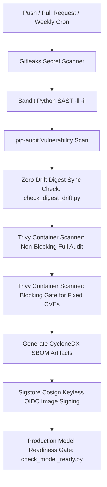

<div align="center">

# 🛡️ AEGIS Phishing Intelligence Platform
### Enterprise-Grade, Self-Contained DevSecOps & Container Infrastructure

[](#-devsecops--ci-cd-pipeline)
[](#-7-layer-defense-in-depth-architecture)
[](#)
[](#-pipeline-scan-duration--timing-breakdown)
[](#)
[](#-devsecops--ci-cd-pipeline)

*A zero-trust, multi-network container ecosystem designed for high-speed, zero-leakage phishing detonation, DOM/vision risk fusion, and automated IOC extraction.*

</div>

---

## 🌟 Overview

The **AEGIS Phishing Intelligence Platform** is a purpose-built, highly isolated orchestration suite for real-time analysis of suspicious web URLs and credential-harvesting pages. Unlike standard sandboxes that expose internal Docker APIs or allow network leaks through WebRTC and DNS rebinding, AEGIS implements a **7-layer defense-in-depth architecture** separating untrusted browser detonation from internal application components.

---

## 🏗️ Stack at a Glance

| Service | Container Name | Base Image | Role & Security Profile | Internal / Host Port |
| :--- | :--- | :--- | :--- | :--- |
| **Receptionist** | `aegis_nginx` | `nginx:1.27-alpine` | Reverse proxy & WebSocket router. Ephemeral 4096-bit TLS auto-generation (`cap_drop: ALL`, non-root). | `80`, `443` (Host) |
| **API & Auth** | `aegis_backend` | `desktop-backend` | FastAPI / Uvicorn API server. JWT auth with SHA-256 pre-hashing & bcrypt (`UID 1001`). | Internal (`8000`) |
| **Database** | `aegis_postgres` | `postgres:16-alpine` | Primary relational datastore (Users, Scans, IOCs, Incidents). | Internal (`5432`) |
| **Broker & Cache**| `aegis_redis` | `redis:7.2-alpine` | Celery message broker & URL scan cache with AOF persistence (`--appendonly yes`). | Internal (`6379`) |
| **Worker Engine** | `aegis_celery_worker`| `desktop-celery_worker`| Executes Stages 1–4 of the scan pipeline (`pytesseract`, OpenCV, ML Risk Ensemble). **Zero Docker CLI/socket access.** | Internal |
| **Scheduler** | `aegis_celery_beat` | `desktop-celery_beat` | Periodic task scheduler (hourly retention cleanup, 10-min job reconciliation). | Internal |
| **Admission Control**| `aegis_sandbox_runner`| `desktop-aegis_sandbox_runner`| **RPC Gateway to Docker Socket.** Enforces `X-Runner-Auth`, UUIDv4 regex, & concurrency limits (`8002`). | Internal (`8002`) |
| **Malware Engine** | `aegis_clamav` | `clamav/clamav:stable` | Isolated `INSTREAM` virus scanning sidecar for quarantined browser artifacts & downloads. | Internal (`3310`) |
| **Detonation Node**| `aegis_sandbox` | `desktop-sandbox` | Ephemeral, read-only Playwright/Chromium container spawned per scan job over isolated network. | Ephemeral |

---

## 🔒 7-Layer Defense-in-Depth Architecture

```
                      [ Browser Extension / Client ]
                                    │
                                    ▼  HTTPS (:443) / WSS (:443)
┌──────────────────────────────────────────────────────────────────────────────────────┐
│  RECEPTIONIST LAYER: aegis_nginx (Non-root, cap_drop: ALL, Ephemeral TLS)            │
└───────────────────────────────────┬──────────────────────────────────────────────────┘
                                    │ /api/* & /ws/* (Proxy Pass)
                                    ▼
┌──────────────────────────────────────────────────────────────────────────────────────┐
│  CORE APPLICATION NETWORK: aegis_net (Isolated from Sandbox & Proxy Socket)          │
│                                                                                      │
│  ┌──────────────────────┐      SQLAlchemy      ┌──────────────────────────────────┐  │
│  │    aegis_backend     │ ───────────────────► │          aegis_postgres          │  │
│  │ (FastAPI / Uvicorn)  │                      └──────────────────────────────────┘  │
│  └──────────┬───────────┘                                                            │
│             │ Enqueue Task                                                           │
│             ▼                                                                        │
│  ┌──────────────────────┐      Dequeue Task    ┌──────────────────────────────────┐  │
│  │     aegis_redis      │ ◄─────────────────── │       aegis_celery_worker        │  │
│  │  (Celery Broker/AOF) │                      │    (Stages 1-4: OCR / Vision)    │  │
│  └──────────────────────┘                      └─────────────────┬────────────────┘  │
└──────────────────────────────────────────────────────────────────┼───────────────────┘
                                                                   │ Authenticated RPC
                                                                   │ (X-Runner-Auth + UUIDv4)
                                                                   ▼
┌──────────────────────────────────────────────────────────────────────────────────────┐
│  ADMISSION CONTROL LAYER: aegis_sandbox_runner (FastAPI on docker_proxy_net)         │
│  • Enforces concurrency semaphore (MAX_CONCURRENT_DETONATIONS = 10 -> HTTP 429)      │
│  • Constructs exact, hardcoded, immutable `docker run --cap-drop ALL --read-only`    │
└───────────────────────────────────┬──────────────────────────────────────────────────┘
                                    │ Filtered Socket API
                                    ▼
┌──────────────────────────────────────────────────────────────────────────────────────┐
│  PROXY SOCKET LAYER: docker_socket_proxy (tecnativa/docker-socket-proxy)            │
│  • Severed from Celery workers. Only accessible by aegis_sandbox_runner.            │
└───────────────────────────────────┬──────────────────────────────────────────────────┘
                                    │ Spawn Ephemeral Container
                                    ▼
┌──────────────────────────────────────────────────────────────────────────────────────┐
│  DETONATION NETWORK: aegis_sandbox_net (Zero access to aegis_net or host services)   │
│                                                                                      │
│  ┌────────────────────────────────────────────────────────────────────────────────┐  │
│  │ aegis_sandbox (Chromium Playwright)                                            │  │
│  │ • Read-only rootfs + tmpfs mounts | pids-limit: 512 | memory: 2g | cpus: 1.5   │  │
│  │ • WebRTC/QUIC disabled (--force-webrtc-ip-handling-policy=disable_non_proxied) │  │
│  │ • Chained through local egress_proxy.py (asyncio.Semaphore(50) tunnel limit)   │  │
│  └───────────────────────────────────────┬────────────────────────────────────────┘  │
│                                          │ INSTREAM Malware Check                    │
│                                          ▼                                           │
│  ┌────────────────────────────────────────────────────────────────────────────────┐  │
│  │ aegis_clamav:3310 (ClamAV Quarantine & Artifact Scanner)                       │  │
│  └────────────────────────────────────────────────────────────────────────────────┘  │
└──────────────────────────────────────────────────────────────────────────────────────┘
                                    │
                                    ▼
┌──────────────────────────────────────────────────────────────────────────────────────┐
│  HOST KERNEL LAYER: Linux iptables DOCKER-USER Chain (scripts/setup_host_firewall.sh)│
│  • Drops all outbound packets from aegis_sandbox_net to:                              │
│    - Cloud Metadata: 169.254.169.254/32 & 169.254.0.0/16                             │
│    - Host Gateways & Loopback: 127.0.0.0/8 & 0.0.0.0/8                               │
│    - RFC 1918 & RFC 6598 (CGNAT): 10.0.0.0/8, 172.16.0.0/12, 192.168.0.0/16          │
└──────────────────────────────────────────────────────────────────────────────────────┘
```

### 🔑 Security Highlights

1. **Complete Socket Severance & Admission Control (`aegis_sandbox_runner`)**
   * **Zero Docker API Exposure**: Workers (`celery_worker`) processing untrusted web content via `pytesseract` OCR or OpenCV vision have **no `docker-cli` installed and zero network access** to the Docker daemon socket (`docker_proxy_net`).
   * **Authenticated RPC Gateway**: Workers request container spawns exclusively via `POST http://aegis_sandbox_runner:8002/detonate`. The runner enforces mandatory `X-Runner-Auth` shared-secret headers and validates that every `scan_id` conforms exactly to canonical UUIDv4 (`_UUID_RE`).
   * **Anti-Resource Exhaustion Semaphores**: `aegis_sandbox_runner` throttles container detonations via an internal `asyncio.Semaphore(10)`. Requests exceeding concurrency limits receive `HTTP 429 Too Many Requests` rather than crashing the Docker daemon.

2. **Kernel-Level Defense-in-Depth (`DOCKER-USER` Host Firewall)**
   * While `ssrf_guard.py` and `egress_proxy.py` provide application-layer validation, `scripts/setup_host_firewall.sh` enforces hard packet drops at the Linux kernel layer.
   * Rules inserted into the `DOCKER-USER` chain guarantee that even if an attacker achieves RCE inside the Chromium container and crafts raw packets bypassing the proxy, the host kernel immediately drops attempts targeting **Cloud Metadata Service (`169.254.169.254`)**, host gateways (`127.0.0.1`), internal networks (`RFC 1918`), or cloud carrier-grade NATs (`RFC 6598 - 100.64.0.0/10`).

3. **WebRTC/QUIC Leak Prevention & DNS Rebinding Protection**
   * Chromium launches with explicit anti-leak flags (`--disable-webrtc`, `--disable-quic`, `--force-webrtc-ip-handling-policy=disable_non_proxied_udp`) to prevent internal host IP discovery via mDNS or UDP bypasses.
   * All outbound requests pass through `egress_proxy.py`, which validates target hostnames, pins resolved IP addresses against version-independent private range tables, and limits active tunnels with `asyncio.Semaphore(50)`.

4. **Quarantine & ClamAV Sidecar (`INSTREAM` Protocol)**
   * Any binary payload or HTML artifact downloaded during detonation is written to `shared_scans/quarantine/` on the shared data volume and immediately evaluated by `aegis_clamav:3310` over TCP `INSTREAM`.
   * Aging scan directories and quarantined artifacts are purged hourly by `file_cleanup.py` to prevent disk exhaustion.

5. **Self-Healing Job Reconciliation & Redis AOF Persistence**
   * Redis operates with Append-Only File persistence (`--appendonly yes`, `--save 60 1`).
   * If a worker node crashes mid-detonation, `tasks.job_reconciliation` runs every 10 minutes via `celery_beat`, identifying orphaned pipeline records and transitioning stuck jobs to `failed_timeout` cleanly.

6. **JWT Session Hardening & Blacklist Revocation (`jti` & Redis)**
   * Every bearer token embeds a unique `jti` (JWT ID) claim. On explicit logout (`POST /api/auth/logout`) or password changes, the token's `jti` is written to a Redis blacklist (`jwt_blacklist:<jti>`) with a TTL matching exactly the token's remaining time-to-live (`exp - now`), instantly revoking compromised or logged-out sessions.
   * Constant-time timing resistance (`_DUMMY_HASH`) prevents account enumeration during login attempts while automatically upgrading legacy hashes to SHA-256 pre-hashed format.

7. **Environment Guardrails & Anti-DoS Payload Limits (`ENVIRONMENT` & Nginx)**
   * Formal separation between `DEBUG` (controls `/docs` visibility) and `ENVIRONMENT="production"`. When running in production, startup guardrails strictly enforce: 32+ character high-entropy secrets, non-wildcard `ALLOWED_HOSTS` and `CORS_ALLOWED_ORIGINS`, immutable `@sha256:` container image pinning, and `CLAMAV_FAIL_CLOSED=True`.
   * Nginx applies location-specific payload limits (`client_max_body_size`): `1M` default for general API/JSON requests to prevent memory exhaustion, `256k` for auth endpoints (`/api/auth/*`), and `50M` strictly reserved for scan submission endpoints (`/api/scans/*`) handling high-resolution screenshot uploads.

---

## ⚡ Pipeline Scan Duration & Timing Breakdown

An end-to-end URL analysis through the 5-stage Celery pipeline typically completes in **10 to 20 seconds**. Below is the stage-by-stage execution flow:

| Pipeline Stage | Module & Tasks Performed | Typical Duration | Timeout / Safety Ceiling |
| :--- | :--- | :--- | :--- |
| **Stage 1: Feature Extraction** | `browser_features.py`<br>Extracts DOM tree structure, performs `pytesseract` OCR text recognition on initial screenshots, and calculates OpenCV image perceptual hashes. | **2 – 5 sec** | ~10 sec |
| **Stage 2: Sandbox & Malware** | `sandbox_analysis.py`<br>**Container Detonation:** RPC to `aegis_sandbox_runner` spawns ephemeral read-only `aegis-sandbox` container over `aegis_sandbox_net` to navigate the target URL, capture network HAR telemetry, and download binaries.<br>**Malware Scanning:** ClamAV sidecar (`aegis_clamav:3310`) inspects artifacts. | **6 – 15 sec** | **45 sec** (Chromium navigation timeout)<br>or **120 sec** (`SANDBOX_TIMEOUT_SEC` hard ceiling) |
| **Stage 3: Cloaking Detection** | `consistency.py`<br>Performs structural and visual diffing between Stage 1 browser features and Stage 2 sandbox telemetry to detect **cloaking** (sites serving benign content to bots/crawlers but phishing pages to normal users). | **0.2 – 0.8 sec** | ~2 sec |
| **Stage 4: ML Risk Ensemble** | `risk_fusion.py`<br>Aggregates multi-modal signals across OCR, DOM, URL heuristics, and cloaking scores into a unified ML risk verdict (`0–100`). Updates Postgres, caches in Redis, and emits `"Done"` via WebSocket. | **0.3 – 0.7 sec** | ~2 sec |
| **Stage 5: Incident Alerting** | `alert_pipeline.py`<br>*(Triggered asynchronously if risk score is `HIGH` or `CRITICAL`)*. Generates formal Incident and IOC records, dispatching SIEM/Slack notifications without blocking user UI response. | **Async (~1 sec)** | Non-blocking |

### 🕒 Execution Scenarios
* **Fast Path (~10 to 18 seconds):** Standard responsive web pages render quickly; final verdict is returned over WebSocket immediately.
* **Bot-Challenged Path (~25 to 35 seconds):** When encountering Cloudflare or bot-mitigation interstitials, the Playwright engine automatically waits up to **10 seconds** (`challenge_wait_seconds`) for the interstitial to self-clear before capturing final DOM and screenshot artifacts.
* **Tarpit Protection (120 seconds):** If a malicious server hangs indefinitely (`HTTP Tarpit`), `aegis_sandbox_runner` forcefully terminates the child container after exactly 120 seconds (`SANDBOX_TIMEOUT_SEC`).

---

## 💾 Shared Data Bus — `shared_scans` Volume

All stages communicate efficiently without passing multi-megabyte payloads through Redis by mounting the `aegis_shared_scans` Docker volume across `celery_worker` and `aegis_sandbox`:

```
shared_scans/
├── quarantine/                  ← ClamAV quarantined downloads and dropped binaries
└── <scan_id>/                   ← Canonical UUIDv4 directory per detonation job
    ├── browser.png              ← Stage 1: Initial browser screenshot
    ├── browser.html             ← Stage 1: Initial raw page HTML
    ├── browser_features.json    ← Stage 1: OCR text, vision hashes, and DOM features
    ├── sandbox.png              ← Stage 2: Sandbox full-page screenshot
    ├── sandbox.html             ← Stage 2: Sandbox rendered DOM HTML
    ├── sandbox_metadata.json    ← Stage 2: Network HAR requests, redirects, & TLS info
    ├── consistency_report.json  ← Stage 3: Cloaking and behavioral diff evaluation
    ├── cyberintel.json          ← Stage 4: External threat intelligence feeds
    └── risk_report.json         ← Stage 4: Final ensemble score & classification verdict
```

---

## 🛠️ DevSecOps & CI/CD Pipeline

AEGIS incorporates automated continuous security enforcement via GitHub Actions (`.github/workflows/devsecops.yml`) and local developer tooling:



### 🧰 Local Security & Automation Commands

We provide a comprehensive `Makefile` and helper scripts (`aegis.ps1` for Windows / PowerShell) for rapid developer onboarding and verification:

```powershell
# ==============================================================================
# 1. Makefile Security & Supply Chain Commands (Linux / macOS / WSL)
# ==============================================================================
make pin-sandbox                      # Build & pin immutable SANDBOX_IMAGE sha256 digest into .env
make security-scan                    # Run local SAST, dependency audits, & Trivy image scans
make run-scan                         # Execute E2E integration verification scan (run_scan.py)

# ==============================================================================
# 2. Host Kernel Firewall Setup (Linux Deployment Hosts)
# ==============================================================================
sudo bash scripts/setup_host_firewall.sh 172.28.0.0/16  # Enforce DOCKER-USER chain isolation

# ==============================================================================
# 3. PowerShell Management Helper (Windows / PowerShell)
# ==============================================================================
.\aegis.ps1 up                        # Start all core services in background
.\aegis.ps1 status                    # Display container health, ports, and memory usage
.\aegis.ps1 logs                      # Follow aggregated colorized logs across all containers
.\aegis.ps1 sandbox https://site.com  # Trigger an immediate test detonation via API
.\aegis.ps1 build                     # Rebuild all local Docker images cleanly
.\aegis.ps1 shell                     # Open interactive bash shell inside aegis_backend
.\aegis.ps1 reset                     # DESTRUCTIVE: Stop containers and wipe shared volumes
```

---

## 📂 Repository Directory Structure

```
docker containers/
├── docker-compose.yml       ← Master multi-network orchestration suite
├── Makefile                 ← DevSecOps automation (digest pinning & local vulnerability scanning)
├── aegis.ps1                ← PowerShell management helper
├── README.md                ← This document
│
├── .github/
│   └── workflows/
│       └── devsecops.yml    ← CI/CD pipeline (Gitleaks, Bandit, pip-audit, Trivy, SBOM, Cosign)
│
├── backend/                 ← FastAPI backend server & Celery task workers
│   ├── Dockerfile           ← Multi-stage optimized API build (builder + runtime)
│   ├── Dockerfile.worker    ← Worker engine build with ClamAV client integration
│   ├── Dockerfile.runner    ← Purpose-built admission control microservice build
│   ├── requirements.txt     ← Pinned Python requirements
│   ├── main.py              ← FastAPI API entrypoint & middleware configuration
│   ├── config.py            ← Pydantic settings & environment definitions
│   ├── celery_worker.py     ← Celery application instance & queue routing
│   ├── celery_beat.py       ← Periodic scheduler configuration
│   ├── api/                 ← REST route handlers (/api/auth, /api/scan, /api/ioc)
│   ├── auth/                ← SHA-256 pre-hashed bcrypt + JWT authentication
│   ├── tasks/               ← 5-Stage Celery pipeline modules & validation guards
│   ├── ai_engine/           ← pytesseract OCR, OpenCV vision, & DOM extractor
│   ├── services/            ← Business logic, ClamAV scanner, & sandbox_runner_svc.py
│   ├── consistency_engine/  ← Stage 3 Diff engine (browser vs sandbox telemetry)
│   ├── database/            ← SQLAlchemy PostgreSQL models & session setup
│   └── websocket/           ← Real-time WebSocket connection manager
│
├── sandbox/                 ← Stage 5 Playwright Detonation Engine
│   ├── docker/              ← Chromium Dockerfile & browser dependencies
│   ├── backend/             
│   │   ├── egress_proxy.py  ← Hardened local proxy with asyncio.Semaphore(50) tunnel limits
│   │   └── ssrf_guard.py    ← Version-independent SSRF blocklists & CGNAT RFC 6598 protection
│   └── tests/               ← Comprehensive async regression suite (test_sandbox_security.py)
│
├── scripts/                 ← Administrative & deployment utilities
│   ├── setup_host_firewall.sh ← Kernel-level DOCKER-USER chain isolation script
│   ├── pin_sandbox.py       ← Automated Docker image digest resolver
│   ├── security_scan.py     ← Local vulnerability sweep runner
│   └── check_model_ready.py ← ML ensemble model verification utility
│
├── nginx/                   ← Receptionist reverse proxy & dynamic TLS generator
└── postgres/                ← Database init scripts & schema creation
```

---

<div align="center">
  <b>AEGIS Phishing Intelligence Platform</b> — Built with zero-trust isolation, hardened container boundaries, and automated DevSecOps pipelines.
</div>